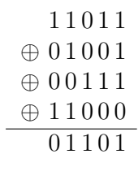

# Nim
This is the final project for COMP 221 - Algorithm Design and Analysis

### Perequisite
Make sure you have at least Java SE 7 version

### Installing
<ul>
  <li> Download Nim.jar file following the directory: out/artifacts/Nim_jar</li>
  <li> Open your terminal </li>
  
  ```
  java -jar Nim.jar
  ```
  </li>
  
  <li>If you have not set up java environment, please go to <a href="https://confluence.atlassian.com/doc/setting-the-java_home-variable-in-windows-8895.html">this site</a>.
  
  </li>
  
</ul>

### Explanation

<p align="center">
    
</p>

* Nim game is a combinatorial game that starts with a few heaps of beans;
* In each turn of the game, a player can remove some or all of the beans in a single heap. A player cannot remove the beans from two heaps at the same time.
* The player plays the game one after another, and the player who makes the last move win the game.

<p align="center">
    
</p>

We can understand this game by converting the number of beans in a heap to binary number. According to the graph above, each row represents the number of beans in a heap. In this case, they are 27, 9, 7, and 24. We conduct a "XOR" operation to these and the result is 13.

A winning move means making the result a 0. Therefore, if the first beans layout makes a 0, the player would not be able win. The algorithm calculates the XOR sum (Nim sum) to play with the player. If the player is facing a non-zero position (N-Position), the player should pick the first odd column (in this case, the second column 1101), pick a 1 and change its row, and aim to make a zero result. (In this case, we picked the first row 11011 to 10110, so we need to take 27-22 = 5 beans off the first heap.)

After the player makes a move, he/she should click "Finish My Turn." After a game, the player can click "Play Again."
